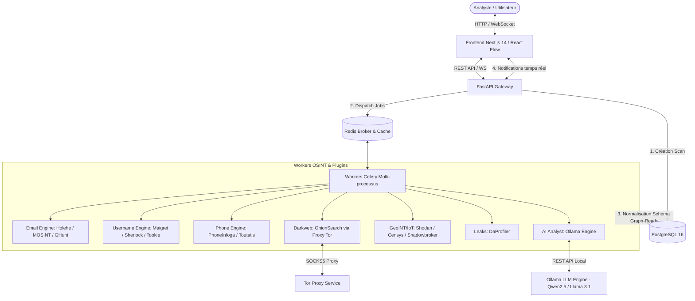

# OSINT-Hub — Architecture Technique & Spécifications

## 1. Vue d'ensemble du Système

**OSINT-Hub** est une plateforme d'OSINT (Open Source Intelligence) souveraine, auto-hébergée et Zero Trust. Elle unifie plus de 15 outils CLI et API open-source sous un tableau de bord interactif sous forme de graphe (style Palantir Foundry / Maltego).

### Principes Architecturaux Clefs
- **Souveraineté & Confidendialité Totale** : 100 % des composants tournent localement ou sur infrastructure privée (VPS/Tailscale). Aucune donnée ou télémétrie n'est envoyée vers un cloud tiers.
- **Modèle Zero Trust & Isolation** : Exposition uniquement sur interface privée (Tailscale/WireGuard, loopback). Traitements CLI isolés sans `shell=True`.
- **Asynchronisme & Modularité** : Orchestration non-bloquante via FastAPI, Celery, et Redis. Chaque outil est un plugin indépendant avec timeout strict (3 min) et gestion de panne isolée.
- **Rétention Strict 7 Jours** : Purge automatique (cron) des logs bruts et résultats de scans au-delà de 7 jours.
- **Intelligence Artificielle Locale** : Modèle LLM (Qwen2.5 / Llama 3.1 via Ollama) exécuté localement pour corréler les entités et synthétiser l'investigation.

---

## 2. Arborescence du Projet (`tree`)

```text
osint-hub/
├── ARCHITECTURE.md                  # Spécifications d'architecture et flux
├── docker-compose.yml              # Composition Multi-services (Coolify / Docker)
├── .env.example                    # Modèle de variables d'environnement
├── README.md                       # Documentation & guide d'installation GitHub
├── assets/
│   └── logo.png                    # Logo de l'application
├── scripts/
│   ├── init_db.sql                 # Schéma et initialisation PostgreSQL 16
│   └── purge_old_scans.py          # Script Cron de purge 7 jours
├── app/
│   ├── __init__.py
│   ├── main.py                     # Gateway API FastAPI (endpoints, WebSockets)
│   ├── config.py                   # Configuration centralisée Pydantic Settings
│   ├── database.py                 # Connexion et session SQLAlchemy / Asyncpg
│   ├── schemas.py                  # Modèles Pydantic v2 (Schéma Universel Graph-Ready)
│   ├── worker.py                   # Configuration Celery & Orchestrateur de tâches
│   ├── api/
│   │   ├── __init__.py
│   │   ├── deps.py                 # Dépendances API (Auth, DB session)
│   │   ├── scans.py                # Endpoints de gestion des scans et WebSocket
│   │   └── modules.py              # Endpoints d'information et statut des modules
│   ├── core/
│   │   ├── __init__.py
│   │   ├── subprocess.py           # Exécuteur CLI sécurisé (asyncio.create_subprocess_exec)
│   │   ├── logger.py               # Logger structuré Structlog
│   │   ├── tor.py                  # Helper routing et verifications SOCKS5 Tor
│   │   └── ai_engine.py            # Client local Ollama (Synthese & Correlation LLM)
│   └── modules/                    # Plugins Outils OSINT (Isolés)
│       ├── __init__.py
│       ├── base.py                 # Classe de base pour les modules OSINT
│       ├── email_holehe.py         # Plugin Holehe (Email)
│       ├── email_mosint.py         # Plugin MOSINT (Email)
│       ├── email_ghunt.py          # Plugin GHunt (Email Google)
│       ├── username_maigret.py     # Plugin Maigret (Username)
│       ├── username_sherlock.py    # Plugin Sherlock (Username)
│       ├── username_tookie.py      # Plugin Tookie-OSINT (Username)
│       ├── phone_phoneinfoga.py    # Plugin PhoneInfoga (Téléphone)
│       ├── phone_toutatis.py       # Plugin Toutatis (Téléphone/Instagram)
│       ├── darkweb_onionsearch.py  # Plugin OnionSearch (Tor / Darkweb)
│       ├── geoint_shodan.py        # Plugin Shodan API (IP/Domaine)
│       ├── geoint_censys.py        # Plugin Censys API (IP/Domaine)
│       ├── geoint_shadowbroker.py  # Plugin Shadowbroker (GeoINT / IoT)
│       ├── leak_daprofiler.py      # Plugin DaProfiler (Data Leaks)
│       └── ai_analyst.py           # Module d'analyse et corrélation IA Ollama
└── frontend/                       # Application Next.js 14+ (App Router)
    ├── package.json
    ├── next.config.js
    ├── tailwind.config.js
    ├── src/
    │   ├── app/
    │   │   ├── layout.tsx
    │   │   ├── page.tsx            # Dashboard Principal
    │   │   ├── investigation/
    │   │   │   └── [id]/page.tsx   # Vue Graphe & Détails Investigation
    │   │   └── settings/page.tsx
    │   ├── components/
    │   │   ├── Navbar.tsx
    │   │   ├── Footer.tsx          # Inclut le lien "Buy Me a Coffee" & Logo
    │   │   ├── GraphView.tsx       # Composant React Flow pour le graphe interactif
    │   │   ├── ScanForm.tsx        # Formulaire de lancement de scan
    │   │   └── AIReportView.tsx    # Rendu du rapport d'analyse IA
    │   ├── lib/
    │   │   ├── api.ts              # Client REST FastAPI
    │   │   └── ws.ts               # Client WebSockets temps réel
    │   └── types/
    │       └── osint.ts            # Types TypeScript pour le Schéma Universel
```

---

## 3. Explication du Flux de Données



### Étapes détaillées de l'exécution :
1. **Initiation** : L'analyste entre un point de départ (*target*: email, nom d'utilisateur, IP, téléphone ou domaine) via le Dashboard Next.js.
2. **Gateway API** : FastAPI valide la requête via Pydantic v2, crée une entrée dans PostgreSQL (`scans`), génère un `scan_id` (UUIDv4) et publie les tâches Celery associées au type de cible.
3. **Exécution Asynchrone Isolée** :
   - Les Workers Celery prennent les tâches en charge.
   - Les modules exécutent les sub-processus CLI via `asyncio.create_subprocess_exec` avec un timeout strict de 3 minutes.
   - Pour les requêtes Darknet/Tor, le flux passe à travers le conteneur Proxy Tor (SOCKS5 `127.0.0.1:9050`).
4. **Normalisation Universelle** : Chaque module transforme la sortie brute de l'outil CLI/API en un format unifié composé de **noeuds** (`nodes`) et de **liens** (`edges`).
5. **Enrichissement par IA Locale** : Une fois les outils CLI terminés, le module IA interroge l'instance Ollama locale pour détecter des corrélations avancées, résumer les risques et suggérer de nouveaux axes d'investigation.
6. **Mise à jour & Visualisation Graphe** : Les résultats sont persistés en base et poussés via WebSocket au frontend React Flow pour mise à jour dynamique du graphe.
7. **Rétention & Purge** : Un cron quotidien exécute `purge_old_scans.py` pour supprimer définitivement les données de plus de 7 jours.

---

## 4. Organisation & Spécifications des Modules OSINT

Chaque module hérite d'une classe abstraite `BaseOSINTModule` garantissant :
- L'isolation totale des exceptions (un crash n'impacte pas les autres modules).
- La sanitization automatique des arguments CLI pour prévenir toute injection de commande.
- La conversion obligatoire vers le **Schéma Universel Graph-Ready**.

| Moteur | Modules / Outils | Cibles Admissibles | Méthode d'exécution |
|---|---|---|---|
| **Email Engine** | Holehe, MOSINT, GHunt | `email` | CLI (`asyncio.create_subprocess_exec`) & API |
| **Username Engine** | Maigret, Sherlock, Tookie-OSINT | `username` | CLI (`asyncio.create_subprocess_exec`) |
| **Phone Engine** | PhoneInfoga, Toutatis | `phone` | CLI & API REST |
| **Dark Web / Tor** | OnionSearch | `domain`, `username`, `email` | CLI via Proxy Tor SOCKS5 |
| **GeoINT / IoT** | Shadowbroker, Shodan API, Censys API | `ip`, `domain` | API REST Async |
| **Data Leaks** | DaProfiler | `email`, `username`, `person` | CLI (`asyncio.create_subprocess_exec`) |
| **AI Analysis Engine** | Ollama (Qwen2.5 / Llama 3.1) | Résultats de Scan aggregés | API REST Ollama (`http://ollama:11434`) |

---

## 5. Garanties de Sécurité & Modèle Zero Trust

1. **Aucun `shell=True`** : Les exécutions CLI utilisent exclusivement des listes d'arguments typées et assainies avec `asyncio.create_subprocess_exec`.
2. **Réseau Privé Sécurisé** : Les ports ne sont pas exposés sur `0.0.0.0` au niveau de l'hôte, sauf écoute locale / réseau Docker interne. L'accès externe se fait via Tailscale / WireGuard ou proxy inverse avec authentification fortifiée.
3. **Secrets en Variables d'Environnement** : Aucun token API (Shodan, Censys, etc.) en dur. Tout passe par le fichier `.env`.
4. **Intégration Privacy Tor** : Les requêtes onion/darkweb sont isolées dans le conteneur Tor SOCKS5 dédié.
