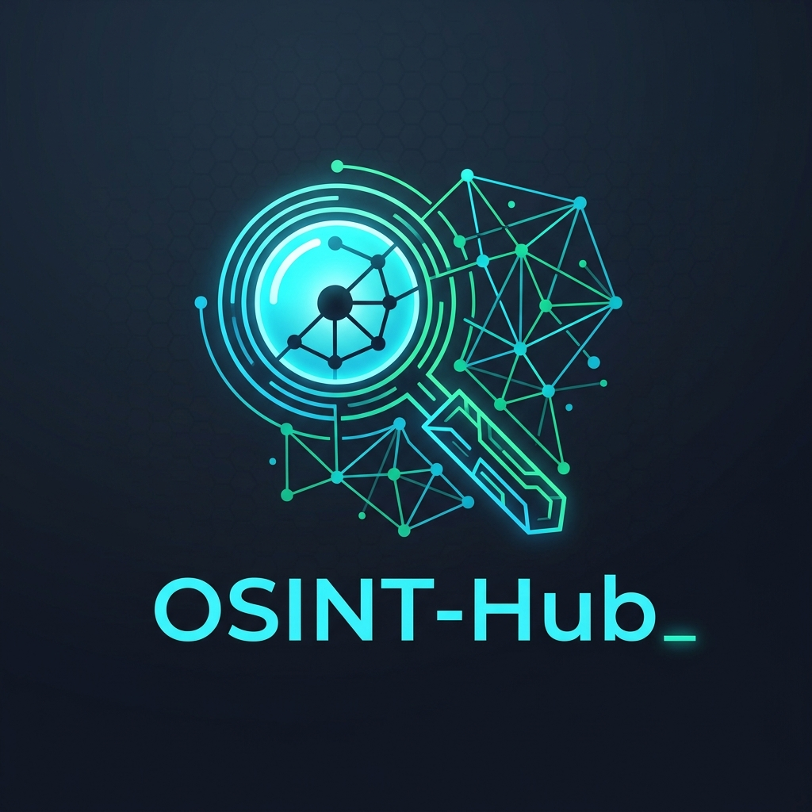

<p align="center">
  
</p>

<h1 align="center">OSINT-Hub</h1>

<p align="center">
  <strong>Sovereign, Self-Hosted OSINT Platform with Graph Visualization & Local AI Intelligence</strong>
</p>

<p align="center">
  <a href="https://github.com"></a>
  <a href="https://docker.com"></a>
  <a href="https://fastapi.tiangolo.com"></a>
  <a href="https://nextjs.org"></a>
  <a href="https://ollama.ai"></a>
  <a href="https://tailscale.com"></a>
</p>

---

## 👁️ Overview

**OSINT-Hub** is a self-hosted, privacy-first Open Source Intelligence (OSINT) platform inspired by enterprise graph-investigation suites (Palantir Foundry, Maltego). It unifies over 15 CLI and API tools under a real-time interactive graph interface, powered by a 100% local Large Language Model (Qwen2.5 / Llama 3.1 via Ollama).

Designed for security researchers, analysts, and privacy advocates, OSINT-Hub operates under a **Zero Trust** security model: **0.0.0.0 public binding is strictly prohibited**, all background commands run in isolated subprocesses, and no data ever leaves your server.

---

## ✨ Key Features

- **🌐 Interactive Investigation Graph**: Built with Next.js 14 and React Flow for dynamic node-edge relationship visualization.
- **🛡️ Sovereign & Zero Trust**: Configured to run behind Tailscale / WireGuard or encrypted local loopback (`127.0.0.1`).
- **🤖 100% Local AI Analyst**: Local Ollama instance correlates entities, highlights risks, and generates executive summaries without external API calls.
- **⚡ Asynchronous & Resilient Pipeline**: Powered by Celery & Redis with strict 3-minute execution timeouts per module. Worker crashes never halt scans.
- **🔒 Integrated Tor SOCKS5**: Onion and darkweb searches run exclusively through an isolated Tor proxy container.
- **🧹 Automatic 7-Day Data Purge**: Internal cron job automatically sanitizes and purges raw logs and scan results after 7 days.

---

## 🛠️ Unified OSINT Engines & Tools

| Category | Unified Tools | Target Types |
| :--- | :--- | :--- |
| **Email Engine** | Holehe, MOSINT, GHunt | `email` |
| **Username Engine** | Maigret, Sherlock, Tookie-OSINT | `username` |
| **Phone Engine** | PhoneInfoga, Toutatis | `phone` |
| **Dark Web / Tor** | OnionSearch | `domain`, `username`, `email` |
| **GeoINT & IoT** | Shodan API, Censys API, Shadowbroker | `ip`, `domain` |
| **Data Leaks** | DaProfiler | `email`, `person` |
| **Local AI Analyst** | Ollama (Qwen2.5 / Llama 3.1) | Aggregate Graph Findings |

---

## 📐 System Architecture

```text
                                +-------------------+
                                | Analyst Dashboard |
                                |  Next.js 14 UI    |
                                +---------+---------+
                                          | HTTP / WebSockets
                                          v
                                +-------------------+
                                | FastAPI Gateway   |
                                +---------+---------+
                                          |
                        +-----------------+-----------------+
                        |                                   |
                        v                                   v
             +--------------------+               +--------------------+
             | PostgreSQL 16 DB   |               | Redis Task Queue   |
             +--------------------+               +---------+----------+
                                                            |
                                                            v
                                                  +--------------------+
                                                  | Celery Workers     |
                                                  +---------+----------+
                                                            |
                     +--------------------------------------+--------------------------------------+
                     |                      |                       |                              |
                     v                      v                       v                              v
             +---------------+      +---------------+       +---------------+              +---------------+
             | Email / User  |      | Phone / Leaks |       | Tor SOCKS5    |              | Ollama AI     |
             | CLI Modules   |      | CLI Modules   |       | Proxy Service |              | Local Engine  |
             +---------------+      +---------------+       +---------------+              +---------------+
```

---

## 🚀 Quick Start & Installation

### Prerequisites
- Docker & Docker Compose v2+
- 8 GB RAM minimum (16 GB recommended for Ollama LLM)
- Tailscale or WireGuard setup (Recommended for remote Zero-Trust access)

### 1. Clone the Repository
```bash
git clone https://github.com/your-username/osint-hub.git
cd osint-hub
```

### 2. Configure Environment Variables
```bash
cp .env.example .env
```
*(Optional: Edit `.env` to add your optional API keys for Shodan or Censys).*

### 3. Launch with Docker Compose
```bash
docker compose up -d --build
```

### 4. Pull Local LLM Model for AI Analyst
```bash
docker exec -it osint_ollama ollama pull qwen2.5:7b
```

### 5. Access the Platform
- **Frontend Interface**: `http://127.0.0.1:3000`
- **Backend API Docs**: `http://127.0.0.1:8000/docs`

---

## 📦 Deployment via Coolify / VPS

OSINT-Hub is pre-configured for one-click deployment on self-hosted PaaS platforms like **Coolify**:
1. Connect your repository to Coolify.
2. Select **Docker Compose** as the build pack.
3. Set environment variables from `.env.example`.
4. Deploy! Ports are safely bound to internal networks only.

---

## ☕ Support & Buy Me a Coffee

OSINT-Hub is free, open-source software built for the security community. If this tool helped your investigations or saved you time, consider supporting further development:

<p align="center">
  <a href="https://www.buymeacoffee.com/yourhandle" target="_blank">
    
  </a>
</p>

---

## 📄 License

Distributed under the MIT License. See `LICENSE` for more information.
